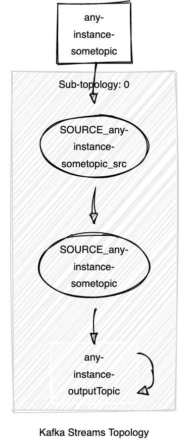

## Hi Quarkus Hacker!

All examples are individual gradle builds + IntelliJ projects.

Demo video:
[](http://www.youtube.com/watch?v=CnTOwNKbsOw "Video Title")

Floodplain itself is hosted here: https://github.com/floodplainio/floodplain-library

To make your own Quarkus / Floodplain project.

 - Create a normal gradle based application, I use gradle (I guess maven works, never tried...)
 - Make sure you add the kotlin extension

 ```bash
 mvn io.quarkus:quarkus-maven-plugin:1.6.0.Final:create -DbuildTool=gradle -Dextensions=kotlin
```
Append the floodplain version to the gradle.properties file:
```
floodplainVersion=0.9.20
```
Now, add the following dependencies to your gradle build:

```gradle
    implementation "io.floodplain:floodplain-integration:${floodplainVersion}"
    implementation "io.floodplain:floodplain-dsl:${floodplainVersion}"
    implementation "io.floodplain:floodplain-mongodb:${floodplainVersion}"
    implementation "io.floodplain:floodplain-googlesheets:${floodplainVersion}"
    implementation "io.floodplain:floodplain-elasticsearch:${floodplainVersion}"
    implementation "io.floodplain:floodplain-runtime:${floodplainVersion}"
```
(I need to create a BOM like super artifact, would make this prettier TODO.)


I use the ElasticSearch sink from Confluent, it is not completely open source, so you need to add the confluent repository to the repositories section of your gradle.build:
```gradle  
	maven {
        url "http://packages.confluent.io/maven"
    }
```
(For example after mavenCentral)
Now the project should build using 'gradle build'

Floodplain is a streaming application. While it is running, it will stream changes from the source(s) to the sink(s)
As sources I now support Postgres and MySQL, as sinks I support MongoDB, ElasticSearch, GoogleSheets (very experimental)
All other databases supported by Debezium should be really easy to add (Cassandra, SQLServer, Oracle, MongoDB, DB2), the most work is create decent tests and find good example data sets.

There is no reason not to add other KafkaConnect sources, I simply didn't have the need.

Sinks should generally be easy when there is a Kafka Connect Sink available, Floodplain only uses a very thin wrapper around it.

The GoogleSheets sink I hacked together myself and is very basic, it does not support deletes for example. I do like it though as it stretches the definition a bit of what a database is.

Floodplain is a command-line application, so for Quarkus it uses the command mode. Extend the QuarkusApplication class, and annotate it with QuarkusMain.
Add a 'return 0' at the end of the method, to appease the compiler.
Like so:
```kotlin
import io.quarkus.runtime.QuarkusApplication
import io.quarkus.runtime.annotations.QuarkusMain

@QuarkusMain
class MyApplication: QuarkusApplication {
    override fun run(vararg args: String?): Int {
        TODO("Not yet implemented")
		return 0
    }
}
```
Now, in the run method we need to 1) create a stream 2) run it.
We create a stream using the stream function. The stream takes a lambda, where you can add a source to the stream.
Most sources require a configuration object first. Only inside a stream we can create a configuration.
Looks like this:
```kotlin
@QuarkusMain
class MyApplication: QuarkusApplication {
    override fun run(vararg args: String?): Int {
        stream {
            val config = mysqlSourceConfig("name","host",3306,"user","pass","database")
            mysqlSource("a_table",config) {
                // do things
            }
        }
        return 0
    }
}
```
All configuration code is now hard coded. It is easy to get the config data from somewhere else, maybe environment variables, or Quarkus configuration.
Now we have a stream of changes from the 'a_table' table in a mysql. We can add transformations to this stream,
and end this with a sink.

Transformations include:

set: Change the message, within the closure the message is mutable. The final message will be passed on.
each: Create a side effect for every message that passes. Practical for logging.
filter: Return true to forward the message, if false it gets dropped
join: Join with another source, but one that shares the same key
joinGrouped: Join with another source that has a different key space, but is grouped by our key
joinRemote: Join with a source with a different key. You need to supply a 'keyExtrator' lambda that will retrieve the key from the message.
buffer: Save up changes for a maximum amount of time and number of messages, overwriting message with the same key
diff: Only propagate if the message is different than the last message with that same key.

Adding your own transformations is possible, and because they use extension functions, they 'feel' native, there is no extra boilerplate code in the consuming application.

Let's add a sink. Sinks also need a configuration object. The final code should looks something like this:

```kotlin
@QuarkusMain
class MyApplication: QuarkusApplication {
    override fun run(vararg args: String?): Int {
        stream {
            val config = mysqlSourceConfig("name","host",3306,"user","pass","database")
            val mongoConfig = mongoConfig("othername","mongodb://localhost","mydatabase")
            mysqlSource("a_table",config) {
                // do things
                filter { key, message ->
                    message.integer("size") > 3
                }
                mongoSink("mycollection","mytopic",mongoConfig)
            }
        }
        return 0
    }
}
```
However, this will just create a stream object, nothing will actually happen. On the stream object, we can call the runWithArguments method.
We can pass the cli arguments in here, and also a lambda what should happen once it started.
In that lambda we should add the Quarkus.waitForExit() call, otherwise the application would terminate immediately.

### Running
We can run our topology in two ways: Run only the Kafka Streams locally, and delegate the source and sink traffic to Kafka Connector instance, and let everything communicate by Kafka, or, run everything locally and remove the need for running Kafka entirely.

The first way is obviously how Kafka Streams and Connect is intended, and is the most robust and scalable option.

For simple streams however, I think the requirement to run Kafka, Zookeeper and a Kafka Connect container is a bit expensive and complicated. If the data set is small, there is no problem with short stream interruptions while restarting, there might be cases that running 'Kafkaless' is preferrable.

The stream object has to distinct methods: renderAndSchedule (for remote) and renderAndExecute for local.

Usually though, you can run it using runWithArguments(args). This will parse command line arguments. If you point to a kafka + connect cluster, like so: ... --kafka localhost:9092 --connect http://localhost:8083/connectors it will run remote, if you supply no flags it will run locally.

For the examples example1 is meant to run remotely and all others are meant to run locally (the other's docker-compose files contain no Kafka cluster). Also bear in mind that due to how docker (compose) works, you might need to tweak the host names of databases. From docker compose containers you *can't access* localhost. If you run in remote mode, the Kafka Connect container will be routing the data between kafka and the data sources/sinks, so in that case you'll need to address the database by their service name, not localhost.


### Topology
Every floodplain run will print out the Kafka Streams topology, it looks in the simplest case something like this:
```
Topologies:
   Sub-topology: 0
    Source: SOURCE_any-instance-sometopic_src (topics: [any-instance-sometopic])
      --> SOURCE_any-instance-sometopic
    Processor: SOURCE_any-instance-sometopic (stores: [])
      --> any-instance-outputTopic
      <-- SOURCE_any-instance-sometopic_src
    Sink: any-instance-outputTopic (topic: any-instance-outputTopic)
      <-- SOURCE_any-instance-sometopic
```
There is a pretty nice online visualzation tool here:
https://zz85.github.io/kafka-streams-viz/

Which gives images like:


### Testing

Testing standalone streams is very easy, using the local renderAndExecute method:
```kotlin
    fun testSimple() {
        stream {
            source("@sometopic") {
                sink("@outputTopic")
            }
        }.renderAndExecute {
            input("@sometopic", "key1", empty().set("name", "gorilla"))
            input("@sometopic", "key1", empty().set("name", "monkey"))
            assertEquals("gorilla", output("@outputTopic").second["name"])
            assertEquals("monkey", output("@outputTopic").second["name"])
        }
    }
```
We can simply feed any message into the topology, and assert which messages should emerge in other topics.

If we want to test with actual databases, we can use testcontainers, that seems to run reasonably well for local testing or CI.


